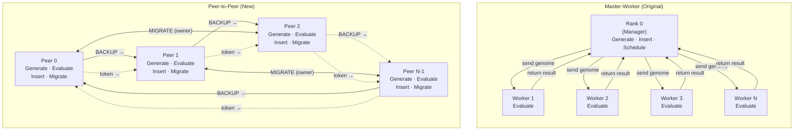
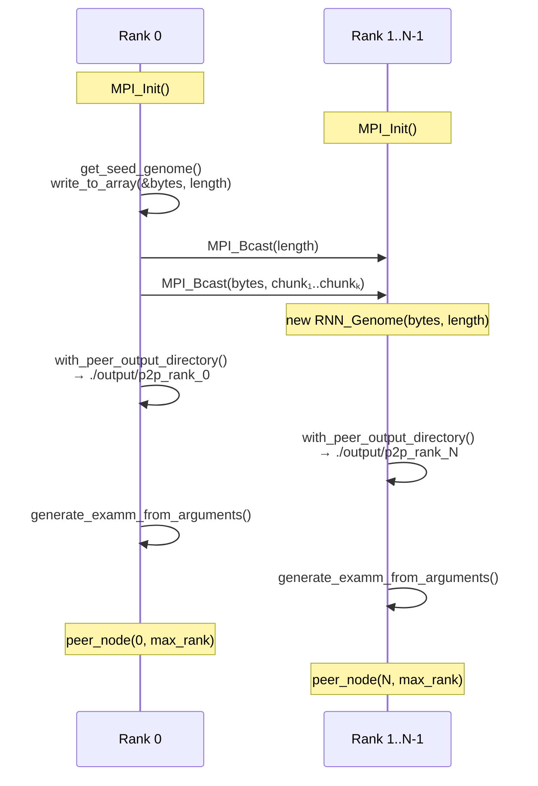
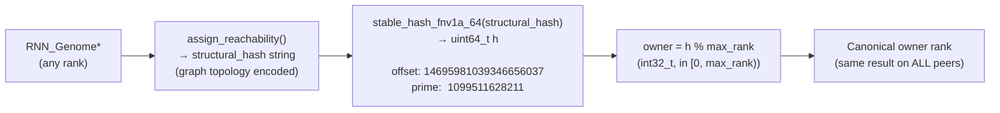
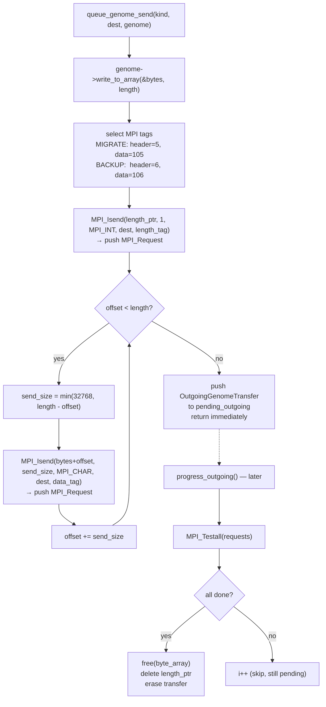
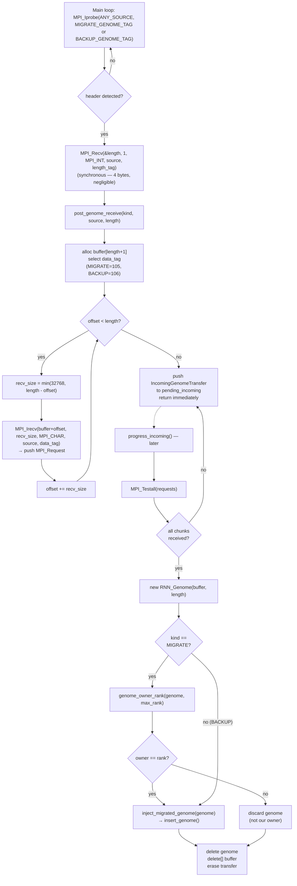
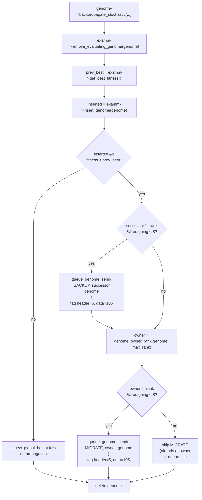
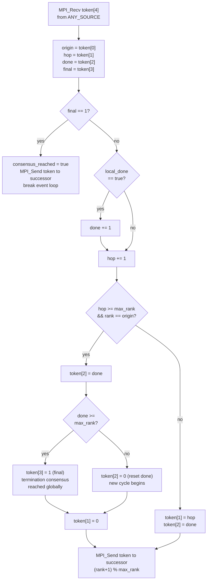
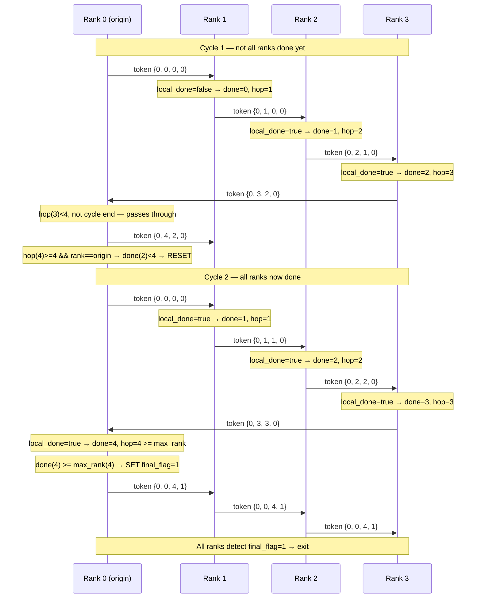
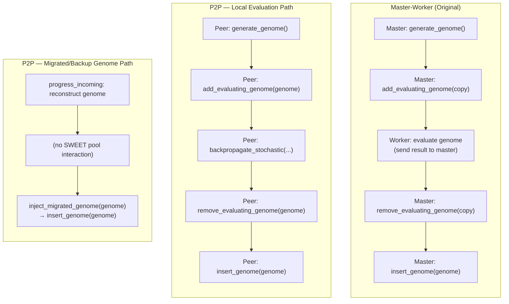

# Decentralizing EXAMM: P2P Architecture — Implementation Design

> This document contains the full **Section III: System Design and Implementation** for the research paper, including all figures. Mermaid diagrams are embedded and render natively on GitHub and in most modern Markdown viewers.

---

## III. System Design and Implementation

### A. Architectural Overview

The decentralized EXAMM architecture replaces the original centralized manager–worker topology with a fully symmetric peer-to-peer (P2P) system in which every MPI rank simultaneously acts as both an evolutionary computation node and a genome-storage participant. In the original design, rank 0 served as an exclusive manager: it generated all genomes via `EXAMM::generate_genome()`, dispatched them to worker ranks via blocking `MPI_Send` / `MPI_Recv` pairs, collected evaluated results, and controlled all insertions into the population. Workers were stateless and passive, having no local EXAMM instance. This design concentrated all scheduling, selection, crossover, and population state at rank 0, making it both a communication bottleneck and a single point of failure.

In the redesigned system, each rank holds a complete, independent `EXAMM` instance initialized from the same seed genome. Each peer independently generates candidate genomes, evaluates them against local training data, and maintains its own island-based population. High-fitness discoveries propagate laterally to neighboring and owning peers through two asynchronous genome transfer protocols (MIGRATE and BACKUP). Global termination is determined by a distributed token-ring consensus protocol that requires no central coordinator. The entire P2P runtime is implemented in a single unified function, `peer_node(int32_t rank, int32_t max_rank)`, which all ranks execute identically after initialization.

**Figure 1** below illustrates the high-level topology contrasting the two architectures.

---

**Figure 1 — Architecture Comparison: Master-Worker vs. P2P Ring**



---

### B. Initialization and Seed Broadcast

A correct P2P initialization requires that every peer begin with a structurally identical seed genome, so that the deterministic ownership hash (Section III-C) produces consistent results across all ranks. Rank 0 constructs the initial seed genome via the existing `get_seed_genome()` factory, which builds a minimal feedforward network from command-line arguments. The binary representation of this genome is then broadcast to all other ranks using `broadcast_genome_seed()`.

The broadcast procedure works as follows. Rank 0 serializes its seed genome to a raw byte array by calling `genome->write_to_array(&byte_array, length)`, which produces a platform-independent binary representation of the genome's node set, edge set, and weight vectors. The byte length is first distributed via `MPI_Bcast(&length, 1, MPI_INT, 0, MPI_COMM_WORLD)`. All ranks then participate in a loop that broadcasts the payload in 32,768-byte chunks using `MPI_Bcast(ptr, send_size, MPI_CHAR, 0, MPI_COMM_WORLD)`. Non-zero ranks reassemble the buffer and reconstruct a genome object via `new RNN_Genome(recv_buffer, length)`. The 32 KB chunk size is chosen to remain below typical MPI message-size limits imposed on many HPC cluster interconnects.

Following seed distribution, each rank rewrites its `--output_directory` argument to a rank-specific subdirectory (`<base_dir>/p2p_rank_<rank>`) via `with_peer_output_directory()`. This ensures that EXAMM's logging, checkpoint, and genome-export operations do not produce write conflicts when all peers operate on a shared filesystem. Each rank then instantiates its own `EXAMM` object via `generate_examm_from_arguments()`, passing the locally reconstructed seed genome and the rank-specific output path.

**Figure 2** shows the initialization sequence across all ranks.

---

**Figure 2 — Initialization and Seed Broadcast Sequence**



---

### C. Genome Ownership via Deterministic Structural Hashing

Central to the P2P design is a mechanism by which every peer can independently and consistently determine the canonical "owner" of any genome — without coordination or global state. This is accomplished through a deterministic structural hash assignment.

Each `RNN_Genome` carries a *structural hash* computed by `assign_reachability()`, a traversal of the genome's directed graph that encodes the reachable topology (node identifiers, connection patterns, and recurrent structure) into a canonical string. This hash is deterministic: two genomes with identical network topology, regardless of their weight values, training history, or which peer produced them, yield the same structural hash string.

The ownership function `genome_owner_rank(const RNN_Genome* genome, int32_t max_rank)` derives the canonical owner from this structural hash. It calls `stable_hash_fnv1a_64(structural_hash)`, which applies the 64-bit FNV-1a algorithm with offset basis `14695981039346656037` and prime `1099511628211`. The owner rank is then:

$$\text{owner} = \text{FNV-1a}_{64}(\text{structural\_hash}) \bmod \text{max\_rank}$$

Because the FNV-1a computation is purely local and the structural hash is deterministic across all peers, every rank independently computes the same owner for any given genome. No communication is required for ownership resolution.

**Figure 3** illustrates the ownership resolution pipeline.

---

**Figure 3 — Deterministic Genome Ownership Resolution**



---

### D. Ring Topology and Successor Structure

A logical unidirectional ring is imposed on the MPI ranks. Each rank `r` has a unique successor defined as:

$$\text{successor}(r) = (r + 1) \bmod \text{max\_rank}$$

This ring serves two independent purposes. First, it defines the path along which BACKUP genome transfers propagate, ensuring that high-fitness genomes discovered at any point on the ring spread clockwise to all other peers within at most `max_rank` hops. Second, it forms the communication substrate for the distributed termination consensus token (Section III-G). The ring is implicit — no explicit membership tables or routing structures are maintained — and requires no peer discovery protocol beyond the static MPI rank assignment.

---

### E. Asynchronous Communication Layer

All peer-to-peer genome transfers are performed asynchronously using non-blocking MPI primitives. This is a fundamental departure from the original master-worker design, which used blocking `MPI_Send` and `MPI_Probe` calls that halted execution while waiting for messages. The asynchronous layer is built around two data structures and three functions.

**Data Structures.** An `OutgoingGenomeTransfer` represents a genome being sent to a remote peer. It holds the destination rank, transfer kind (MIGRATE or BACKUP), the serialized byte array, a heap-allocated length pointer, and a `std::vector<MPI_Request>` containing one request handle per MPI call (one for the length header, one per 32 KB chunk). An `IncomingGenomeTransfer` represents a genome being received. It holds the source rank, transfer kind, a reassembly buffer of `length + 1` bytes, and a `std::vector<MPI_Request>` containing one request per received chunk.

**Initiating Outbound Transfers.** `queue_genome_send()` serializes the genome to a byte array, posts a non-blocking `MPI_Isend` for the 4-byte length header using the appropriate length tag (tag 5 for MIGRATE, tag 6 for BACKUP), and then posts one `MPI_Isend` per 32 KB chunk of the payload using the corresponding data tag (tag 105 for MIGRATE, tag 106 for BACKUP). All MPI request handles are collected into the `OutgoingGenomeTransfer` object. The function returns immediately without waiting for delivery.

**Initiating Inbound Transfers.** Once the main loop detects an incoming length header via a non-blocking probe, it receives the 4-byte length synchronously, then calls `post_genome_receive()`. This function allocates a reassembly buffer, posts one non-blocking `MPI_Irecv` per 32 KB chunk, and appends the resulting `IncomingGenomeTransfer` to `pending_incoming`. It returns without waiting for data delivery.

**Polling Progress.** `progress_outgoing()` iterates over all queued outbound transfers, calling `MPI_Testall()` on each transfer's request vector. When all requests complete, the serialized byte array and length pointer are freed. `progress_incoming()` does the same for inbound transfers: when all chunk receives complete, it reconstructs an `RNN_Genome` from the assembled buffer, applies ownership filtering for MIGRATE transfers, and calls `examm->inject_migrated_genome(genome)` if the insertion should proceed.

Flow control is enforced via the constant `MAX_PENDING_TRANSFERS = 8`. Before posting any new send or receive, the main loop checks that the relevant pending queue has not reached this capacity.

**Figure 4** shows the data flow through the async communication layer for an outbound transfer.

---

**Figure 4 — Asynchronous Genome Transfer Protocol (Send Path)**



---

**Figure 5** shows the receive-side path including ownership filtering.

---

**Figure 5 — Asynchronous Genome Transfer Protocol (Receive Path)**



---

### F. Dual-Mode Genome Replication: MIGRATE and BACKUP

Only genomes that represent a new global best fitness for the discovering peer are propagated to other peers. This selective replication avoids flooding the network with suboptimal candidates and ensures that inter-peer communication overhead scales with discovery rate rather than evaluation throughput.

After a genome is evaluated and inserted into the local population, the peer checks:

```cpp
const double prev_best  = examm->get_best_fitness();
const bool   inserted   = examm->insert_genome(genome);
const bool   is_new_global_best = inserted && genome->get_fitness() < prev_best;
```

If `is_new_global_best` is true, two conditional transfers are initiated:

**BACKUP transfer.** The genome is sent to the immediate ring successor. The BACKUP mechanism provides rapid propagation of high-fitness solutions around the ring. Because every peer inserts BACKUP genomes unconditionally upon receipt (the ownership filter is not applied), a high-fitness genome discovered at any rank can propagate to all peers in at most `max_rank − 1` discovery events.

**MIGRATE transfer.** The genome is also sent directly to its computed canonical owner. This transfer is only dispatched if `owner != rank`. The MIGRATE mechanism ensures that the canonical storage node for a given genome topology always receives the best-known evaluation of that genome, providing distributed memory consolidation.

Both transfer types use separate MPI tag namespaces, ensuring that the main loop can probe for each type independently.

**Figure 6** shows the replication decision logic after a successful genome insertion.

---

**Figure 6 — Genome Replication Decision After Local Evaluation**



---

### G. The Peer Event Loop

The function `peer_node(int32_t rank, int32_t max_rank)` is the unified runtime entry point for all peers. It runs a single event loop that continuously interleaves background communication progress, termination consensus polling, incoming genome detection, and local evolutionary computation. **Figure 7** provides the complete flowchart of this loop.

---

**Figure 7 — peer_node() Main Event Loop**

```mermaid
flowchart TD
    START(["peer_node(rank, max_rank)\nsuccessor = (rank+1) % max_rank\nlocal_done = false\nconsensus_reached = false"])

    INIT{rank == 0\n&& max_rank > 1?}
    SEND_TOKEN["MPI_Send({0,0,0,0}, successor\nTERMINATION_TOKEN_TAG)"]

    LOOP(["while !consensus_reached"])

    PO["progress_outgoing(pending_outgoing)\nMPI_Testall → free completed sends"]
    PI["progress_incoming(pending_incoming, examm)\nMPI_Testall → inject completed receives"]

    PROBE_TOK["MPI_Iprobe(ANY, TERMINATION_TOKEN_TAG)"]
    TOK_FLAG{token\narrived?}
    PROC_TOK["MPI_Recv token[4]\nprocess token\n(see Fig. 8)"]
    FINAL{final_flag\n== 1?}
    CONSENSUS["consensus_reached = true\nMPI_Send token to successor\nbreak"]

    PROBE_MIG["MPI_Iprobe(ANY, MIGRATE_GENOME_TAG)\nwhile pending_incoming < 8"]
    MIG_FLAG{MIGRATE\nheader?}
    RECV_MIG["MPI_Recv length\npost_genome_receive(MIGRATE)"]

    PROBE_BAK["MPI_Iprobe(ANY, BACKUP_GENOME_TAG)\nwhile pending_incoming < 8"]
    BAK_FLAG{BACKUP\nheader?}
    RECV_BAK["MPI_Recv length\npost_genome_receive(BACKUP)"]

    SINGLE{max_rank == 1\n&& local_done?}
    EXIT_SINGLE["consensus_reached = true\nbreak"]

    EVOLVE_COND{!local_done\n&& pending_incoming\n.empty()?}

    GEN["genome = examm->generate_genome()"]
    NULL_CHK{genome\n== NULL?}
    SET_DONE["local_done = true\ncontinue"]

    EVAL["examm->add_evaluating_genome(genome)\ngenome->backpropagate_stochastic(...)"]
    INSERT["examm->remove_evaluating_genome(genome)\nprev_best = get_best_fitness()\ninserted = insert_genome(genome)"]
    REPLICATE["is_new_global_best check\n→ queue BACKUP / MIGRATE\n(see Fig. 6)"]
    DEL["delete genome"]

    SLEEP["sleep_for(1ms)\n(avoid tight spin)"]

    DRAIN(["Drain in-flight transfers\nMPI_Waitall pending_incoming\nMPI_Waitall pending_outgoing\nFinal progress pass"])
    END(["return"])

    START --> INIT
    INIT -- yes --> SEND_TOKEN --> LOOP
    INIT -- no --> LOOP

    LOOP --> PO --> PI
    PI --> PROBE_TOK --> TOK_FLAG
    TOK_FLAG -- yes --> PROC_TOK --> FINAL
    FINAL -- yes --> CONSENSUS
    FINAL -- no --> PROBE_MIG
    TOK_FLAG -- no --> PROBE_MIG

    PROBE_MIG --> MIG_FLAG
    MIG_FLAG -- yes --> RECV_MIG --> PROBE_MIG
    MIG_FLAG -- no --> PROBE_BAK

    PROBE_BAK --> BAK_FLAG
    BAK_FLAG -- yes --> RECV_BAK --> PROBE_BAK
    BAK_FLAG -- no --> SINGLE

    SINGLE -- yes --> EXIT_SINGLE
    SINGLE -- no --> EVOLVE_COND

    EVOLVE_COND -- yes --> GEN --> NULL_CHK
    NULL_CHK -- yes --> SET_DONE --> LOOP
    NULL_CHK -- no --> EVAL --> INSERT --> REPLICATE --> DEL --> LOOP

    EVOLVE_COND -- no --> SLEEP --> LOOP

    CONSENSUS --> DRAIN
    EXIT_SINGLE --> DRAIN
    DRAIN --> END
```

---

### H. Distributed Termination Consensus via Token Ring

In the original master-worker design, termination was determined centrally: the manager counted the number of `NULL` returns from `generate_genome()` and sent explicit `TERMINATE` messages to each worker. In the P2P design, no single rank holds global visibility of the system's termination state. Instead, a distributed token-ring consensus protocol ensures that the system exits only after all peers have independently reported completion of their local search.

Each rank's local search terminates when `examm->generate_genome()` returns `NULL`. The peer sets `local_done = true` but continues running the main event loop to process any incoming genome transfers and to participate in the consensus protocol.

**Token Structure.** The consensus token is a 4-element `int32_t` array:

| Field | Index | Meaning |
|---|---|---|
| `origin_rank` | 0 | Which rank initiated the current token cycle |
| `hop_count` | 1 | Ranks that have processed the token this cycle |
| `done_count` | 2 | Cumulative count of ranks reporting `local_done = true` |
| `final_flag` | 3 | 0 = running; 1 = all done, exit |

**Protocol Execution.** Rank 0 initiates by sending `{0, 0, 0, 0}` to rank 1. Each rank polls non-blocking with `MPI_Iprobe`. Upon receipt: if `final_flag == 1`, consensus is reached; otherwise the rank increments `done_count` if local, increments `hop_count`, then checks for cycle completion (`hop_count >= max_rank && rank == origin_rank`). At cycle end the origin evaluates: if `done_count >= max_rank` it sets `final_flag = 1`, otherwise it resets both counts for the next cycle. The token is then forwarded to the successor.

**Figure 8** shows the complete token processing logic at each rank.

---

**Figure 8 — Distributed Token-Ring Termination Protocol**



**Figure 9** shows a concrete example of the token circulating across 4 ranks, requiring two cycles to reach consensus.

---

**Figure 9 — Token Circulation Example: 4 Ranks, 2 Cycles to Consensus**



---

### I. Integration with the EXAMM Population Manager

The EXAMM population manager was minimally modified to support P2P operation. The existing `insert_genome(RNN_Genome*)` method handles deduplication, island assignment, and sorted population maintenance. To make the P2P call site semantically explicit and to decouple it from assumptions embedded in the master-worker workflow, a new method `inject_migrated_genome(RNN_Genome* genome)` was added to the `EXAMM` class (`examm/examm.hxx:131`).

```cpp
bool EXAMM::inject_migrated_genome(RNN_Genome* genome) {
    return insert_genome(genome);
}
```

The implementation forwards directly to `insert_genome()`, reusing its existing accounting, consistency guarantees, and population logic. Crucially, `inject_migrated_genome` does *not* interact with the SWEET (Selection While Evaluating in Tournament) pool: migrated and backup genomes have already been fully evaluated by the sending peer, so they must not be added to the local evaluating pool or counted as pending evaluations. This prevents artificially inflating the SWEET pool size on the receiving peer, which would interfere with the local peer's generation scheduling.

The SWEET pool is managed correctly in the local evaluation path: `examm->add_evaluating_genome(genome)` is called immediately before `backpropagate_stochastic()`, and `examm->remove_evaluating_genome(genome)` is called immediately after, before the genome is inserted into the population.

**Figure 10** contrasts the SWEET pool lifecycle in the old master-worker design versus the new P2P design.

---

**Figure 10 — SWEET Pool Lifecycle: Master-Worker vs. P2P**



---

### J. Evolutionary Operations in the P2P Context

All mutation and crossover operations in the P2P system remain entirely local to each peer and are unchanged from the original EXAMM implementation. The `IslandSpeciationStrategy` on each peer independently selects parents from its local island populations, applies structural mutations (node insertion/deletion, edge splitting, weight perturbation) or crossover (topology inheritance from the fitter parent, weight blending from either parent) through the existing operator library, and returns candidate genomes for evaluation.

The P2P layer contributes to evolutionary diversity through implicit gene-pool mixing: genomes injected via `inject_migrated_genome` from other peers become resident members of the receiving peer's local island population and are immediately eligible for selection as parents in subsequent crossover operations. This produces a topology-aware migration pattern where high-fitness genomes from geographically local peers (defined by ring adjacency for BACKUP transfers, and by structural hash proximity for MIGRATE transfers) enrich the local population without requiring synchronous generation barriers. The result is consistent with the asynchronous island model described by Pavlenko et al. [14], in which results are incorporated continuously as they arrive rather than waiting for full-generation completion.

---

### K. Comparison to the Replaced Master-Worker Architecture

**Table I** summarizes the structural differences between the original master-worker design (preserved as dead code under `#if 0` at lines 421–549 of `mpi/examm_mpi.cxx`) and the P2P design.

**Table I — Master-Worker vs. P2P Architecture Comparison**

| Component | Master-Worker | P2P |
|---|---|---|
| Genome generation | Centralized (rank 0 only) | Distributed (all ranks independently) |
| EXAMM instance | Single (rank 0) | One per rank |
| Communication mode | Blocking `MPI_Send` / `MPI_Recv` | Non-blocking `MPI_Isend` / `MPI_Irecv` |
| Population management | Single global population at rank 0 | Independent island populations per rank |
| SWEET pool management | Managed by master for all workers | Managed locally per peer |
| Inter-peer genome transfer | None (all data flows through master) | MIGRATE + BACKUP async transfers |
| Termination | Master counts worker terminates | Distributed token-ring consensus |
| Output isolation | Single shared directory | Per-rank subdirectory (`p2p_rank_N`) |
| Single point of failure | Rank 0 | None |
| Worker idle time | Yes (waiting for master response) | Minimal (1 ms sleep when no work) |

---

### L. Test Coverage

Two test executables validate the P2P implementation:

**`test_examm_inject_migrated_genome`** (`rnn_tests/test_examm_inject_migrated_genome.cxx`) is a non-MPI unit test that verifies the `EXAMM::inject_migrated_genome` API in isolation. It constructs a minimal EXAMM instance with one island of capacity 8, inserts a fully-evaluated feedforward genome via `inject_migrated_genome`, and asserts that (1) the method returns `true` indicating successful population entry, (2) the `evaluated_genomes` counter increments by exactly 1, and (3) a best genome exists in the speciation strategy's state after insertion.

**`test_examm_mpi_p2p_helpers`** (`mpi/test_examm_mpi_p2p_helpers.cxx`) is an MPI test requiring exactly two ranks. It validates five properties:

1. **Hash correctness**: `stable_hash_fnv1a_64("abc")` produces `0xe71fa2190541574b` and `stable_hash_fnv1a_64("")` produces `0xcbf29ce484222325`, verifying against the known FNV-1a 64-bit constants.
2. **Output directory rewrite**: `with_peer_output_directory` correctly replaces the `--output_directory` value in an argument list.
3. **Deterministic ownership**: `genome_owner_rank` returns a value in `[0, max_rank)` equal to `FNV-1a(structural_hash) % max_rank`, confirming deterministic assignment.
4. **Chunked async transfer**: A genome large enough to exceed the 32 KB chunk boundary is sent from rank 0 to rank 1 using the full `queue_genome_send` / `post_genome_receive` / `progress_outgoing` / `progress_incoming` pipeline, and the receiving peer's evaluated genome count increases by exactly 1 upon completion.
5. **Seed broadcast fidelity**: A genome broadcast from rank 0 via `broadcast_genome_seed` produces structurally identical genomes on both ranks, verified by comparing FNV-1a hashes of both structural hash strings.

---

## Figure Index

| Figure | Title | Section |
|---|---|---|
| Fig. 1 | Architecture Comparison: Master-Worker vs. P2P Ring | III-A |
| Fig. 2 | Initialization and Seed Broadcast Sequence | III-B |
| Fig. 3 | Deterministic Genome Ownership Resolution | III-C |
| Fig. 4 | Asynchronous Genome Transfer Protocol (Send Path) | III-E |
| Fig. 5 | Asynchronous Genome Transfer Protocol (Receive Path) | III-E |
| Fig. 6 | Genome Replication Decision After Local Evaluation | III-F |
| Fig. 7 | `peer_node()` Main Event Loop | III-G |
| Fig. 8 | Distributed Token-Ring Termination Protocol | III-H |
| Fig. 9 | Token Circulation Example: 4 Ranks, 2 Cycles | III-H |
| Fig. 10 | SWEET Pool Lifecycle: Master-Worker vs. P2P | III-I |

---

## MPI Tag Reference

| Tag | Value | Purpose |
|---|---|---|
| `WORK_REQUEST_TAG` | 1 | (Legacy) Worker requests work from master |
| `GENOME_LENGTH_TAG` | 2 | (Legacy) Length header for master-worker transfer |
| `GENOME_TAG` | 3 | (Legacy) Genome data for master-worker transfer |
| `TERMINATE_TAG` | 4 | (Legacy) Master instructs worker to exit |
| `MIGRATE_GENOME_TAG` | 5 | P2P: Length header for MIGRATE transfer |
| `BACKUP_GENOME_TAG` | 6 | P2P: Length header for BACKUP transfer |
| `TERMINATION_TOKEN_TAG` | 7 | P2P: Termination consensus token |
| `SEED_GENOME_LENGTH_TAG` | 8 | Initialization: seed genome byte length |
| `SEED_GENOME_DATA_TAG` | 9 | Initialization: seed genome data chunks |
| `MIGRATE_GENOME_DATA_TAG` | 105 | P2P: Chunked payload for MIGRATE transfer |
| `BACKUP_GENOME_DATA_TAG` | 106 | P2P: Chunked payload for BACKUP transfer |
